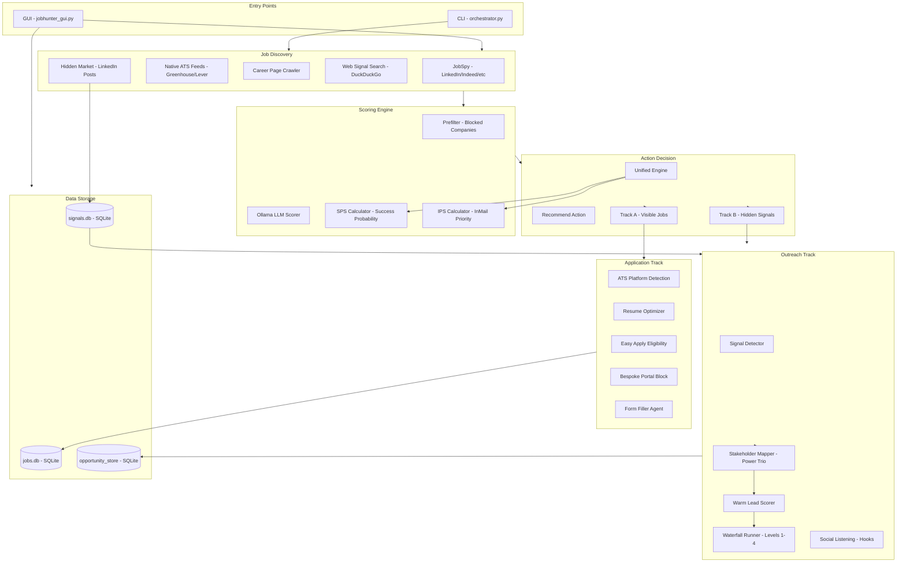

# JobHuntrr - Complete System Workflow

**A dual-track job hunting automation platform: visible job boards + hidden opportunity discovery, unified by an intelligent decision engine.**

---

## System Architecture



---

## 1. Entry Points

### GUI Entry (`gui/jobhunter_gui.py`)
**Launch:** `python gui/jobhunter_gui.py`

**Tabs:**
- **Jobs** - Main job tracker with filtering, scoring, manual apply marking
- **Action Queue** - SPS-sorted opportunities with recommended actions (referral_first / network_only / apply_now / monitor / ignore)
- **Console** - Live pipeline logs with stop/start controls
- **LinkedIn DM** - Outreach queue management (connection requests, follow-ups, InMail drafts)
- **Chat** - LLM chat with job context for cover letters, outreach personalization
- **Profile Settings** - Email, phone, LinkedIn credentials, Ollama model selection
- **Requirements** - Markdown editor for applicant_requirements.md (role targets, thresholds, salary floor)

**Key Actions:**
- Run discovery pipeline (headless/visible browser, dry-run/live mode)
- Score selected jobs
- Apply to selected jobs (calls `form_filler.py`)
- Mark manual applies (requires confirmation evidence - no blind "applied" flag)
- Push signals to outreach queue
- Queue stakeholder outreach for high-SPS jobs

### CLI Entry (`orchestrator.py`)
**Launch:** `python orchestrator.py --run-once` or scheduled mode

**Flags:**
- `--dry-run` - Fill forms but don't submit (safe default)
- `--apply` - Enable live applications (requires `--dry-run=False`)
- `--headless` - Run browser in background
- `--limit N` - Discover max N jobs
- `--gcc-only` - Apply only to GCC-location jobs
- `--include-previously-seen` - Rediscover previously indexed URLs

**Scheduled Mode:**
Runs every `RUN_EVERY_HOURS` hours (configured in `config/config.py`)

---

## 2. Job Discovery (Track A - Visible Market)

### Primary Source: JobSpy (`agents/discovery.py`)
**Engine:** [python-jobspy](https://github.com/Bunsly/JobSpy)
**Sites:** LinkedIn, Indeed, Glassdoor, ZipRecruiter
**Filters:**
- Search queries from `config/config.py` (e.g., "quantitative analyst Abu Dhabi", "investment analyst UAE")
- Hours fresh (default 168 hours = 7 days)
- Blocked companies (ADIA, ADIC per `config/applicant_requirements.py`)
- Blocked keywords (sales, commission-only, crowdsourced AI platforms)
- Max years required (hard skip if ≥7 years, penalize 5–6 years)
- Dedup by `job_url`

### Secondary Sources (Zero-Cost Web Scraping)

#### Native ATS Feeds (`agents/ats_feed_fetcher.py`)
**Platforms:** Greenhouse, Lever, Ashby public APIs
**Purpose:** Catch listings before aggregators index them
**Registry:** `config/employer_registry.json` maps companies to their ATS endpoints

#### Career Page Crawler (`agents/career_page_crawler.py`)
**Method:** Sitemap + JSON-LD JobPosting extraction
**Use Case:** Custom/Workday/Taleo employers with no public API
**Registry:** Same `employer_registry.json`

#### Web Signal Discovery (`agents/web_signal_discovery.py`)
**Engine:** DuckDuckGo search (no API key)
**Queries:** `site:linkedin.com/posts "DM me" "Abu Dhabi" hiring`
**Output:** LinkedIn hiring posts before they become formal job listings
**Max Results:** 15 per run (configurable via `WEB_SIGNAL_MAX_RESULTS`)

### URL Deduplication
**Storage:** `data/seen_urls.json`
**Behavior:** Persists across runs; skip previously discovered URLs unless `--include-previously-seen` flag set

---

## 3. Scoring System

### Prefilter (`agents/job_fit.py`)
**Hard Skip Rules (score=0, decision=skip):**
- Company in `BLOCKED_COMPANIES` (ADIA, ADIC)
- Keywords: "sales representative", "commission only", "customer service"
- Crowdsourced platforms (DataAnnotation, Scale AI, Appen, Outlier, Remotasks)
- Senior/Lead/Manager/VP/Director titles (unless "Junior" or "Graduate" prefix)
- 7+ years hard requirement
- Salary below minimum floor (default 27,000 AED/month)

### LLM Scoring (`agents/scorer.py`)
**Model:** Ollama (local inference, no API costs)
**Default Model:** `qwen2.5-coder:32b` (configured in `profile_settings.json`)

**System Prompt Components:**
- Candidate profile (from `CANDIDATE_PROFILE` or `applicant_requirements.md`)
- Career stage calibration (0–3 years = full scoring, 4–6 years = manual_review, 7+ = hard skip)
- Two-sided scoring: job requirements vs candidate offerings + candidate targets vs job industry

**Scoring Breakdown (0–100 total):**
- `compensation_potential` (40) - Absolute earning power within 2 years (UAE/GCC base OR elite Western comp)
- `progression_speed` (20) - Career growth trajectory
- `brand_signal` (15) - Top-tier brand (Mubadala, ADQ, G42, Citadel, Goldman, etc.)
- `profile_fit` (15) - Match to math + software + investments + research + founder background
- `strategic_optionality` (10) - Opens doors in target areas (quant, AI, space, energy, fintech)

**Decision Thresholds:**
- **75–100** → `auto_apply`
- **60–74** → `manual_review`
- **<60** → `skip`

**Output Fields:**
- `score` (0–100)
- `decision` (auto_apply / manual_review / skip)
- `fit_reason` - 1–2 sentences explaining fit
- `skip_reason` - 1 sentence if skipping
- `positioning_angle` - Which profile angle to lead with (quant / investments / AI / space / energy / fintech / climate / strategy / cyber)
- `outside_target_industry` - True if role is outside stated targets
- `suggested_alternate` - True if outside targets but still worth applying (score ≥75, strong skill match)

---

## 4. Unified Engine - Success Probability Scores

### SPS (Success Probability Score) - Track A
**Formula:**
```
SPS = 0.20×RoleFit + 0.20×Connection + 0.15×ATS + 0.15×Timing
    + 0.10×Urgency + 0.10×CompanyPriority + 0.10×OutreachQuality
```

**Components (each 0–100):**

1. **RoleFit** (0.20 weight)
   - Base: `score` from LLM scorer
   - Scaled `profile_fit` breakdown (0–15 → 0–100)
   - Penalty if `matches_stated_targets` = False (×0.85)

2. **Connection** (0.20 weight)
   - Warm lead score if contact present (0–100)
   - Alumni match: +20
   - Shared employer: +15
   - 1st-degree connection: +35
   - Mutual connections: +4 per person (max +20)
   - Baseline: 25 if no connection

3. **ATS Match** (0.15 weight)
   - LinkedIn Easy Apply: 90
   - Known portals (Greenhouse, Lever, Ashby, Workday): 75
   - AI-driven (unknown): 40
   - Bespoke portals (McKinsey, Goldman, sovereign funds): networking only (blocked from auto-apply)

4. **Timing** (0.15 weight)
   - ≤24 hours: 95
   - ≤48 hours: 70
   - ≤7 days: 45
   - >7 days: 25

5. **Urgency** (0.10 weight)
   - <25 applicants: 95
   - <50 applicants: 80
   - <100 applicants: 45
   - ≥100 applicants: 20

6. **CompanyPriority** (0.10 weight)
   - Tier 1 target: 90 (Mubadala, ADQ, G42, Brevan Howard, Millennium, McKinsey, etc.)
   - Others: 50

7. **OutreachQuality** (0.10 weight)
   - Baseline: 50
   - +15 if `fit_reason` present
   - +10 if `positioning_angle` set
   - +15 if outreach hooks extracted

**SPS Bands:**
- **≥85** → `immediate_action`
- **≥70** → `apply_and_network`
- **≥50** → `network_only`
- **<50** → `monitor`

### IPS (InMail Priority Score) - Track B
**Formula:**
```
IPS = 0.30×RoleFit + 0.25×ContactPower + 0.20×Timing
    + 0.15×CompanyPriority + 0.10×Warmth
```

**Components:**
1. **RoleFit** (0.30) - Same as SPS
2. **ContactPower** (0.25)
   - Recruiter/Talent/Hiring Manager/Head of/Director: 85
   - Analyst/Associate/Engineer: 65
   - Unknown: 50
3. **Timing** (0.20) - Same as SPS
4. **CompanyPriority** (0.15) - Same as SPS
5. **Warmth** (0.10) - Warm lead score

**InMail Threshold:**
- IPS ≥75 → Paid InMail eligible
- IPS <75 → Use free methods only (connection request, email discovery)

---

## 5. Recommended Action Decision (`engine/recommend_action.py`)

**Single decision brain - preferred order:**
```
Hidden → Warm lead → Referral → Network → Apply (last resort)
```

**Actions:**
1. **`referral_first`** - Pause apply, request referral from warm lead (score ≥70, SPS ≥85)
2. **`network_only`** - Do NOT auto-apply; stakeholder outreach required
3. **`apply_now`** - Eligible for auto-apply queue
4. **`monitor`** - Low priority, watch for updates
5. **`ignore`** - Skip (scored below thresholds)

**Decision Logic:**

### Hard Blocks (network_only / referral_first):
- Bespoke portals (McKinsey, Goldman, Blackrock, sovereign funds) → `network_only`
- LinkedIn Easy Apply: age ≥24h OR applicants ≥50 → `network_only`
- SPS band = `network_only` → `network_only`
- Warm lead score ≥70 AND SPS ≥85 → `referral_first`
- Hidden track (employee_post, web_indexed, signal) + SPS ≥70 → `network_only`

### Apply Eligibility:
- NOT bespoke portal
- NOT Easy Apply with missed window
- SPS band ≥ `apply_and_network`
- Referral status NOT `requested` (unless `referred`, `declined`, or `timeout`)
- Decision = `auto_apply`

**Referral Gate:**
- If `referral_status` = `requested` → block auto-apply, wait for human to mark `referred` / `declined` / `timeout`
- After 72 hours (default `referral_block_hours`), system recommends timeout override

---

## 6. Track A (Visible Market) - Application Pipeline

### ATS Platform Detection (`agents/unified_engine.py`)
**Detects from URL patterns:**
- **linkedin** - `linkedin.com/jobs`
- **greenhouse** - `boards.greenhouse.io`
- **lever** - `jobs.lever.co`
- **ashby** - `jobs.ashbyhq.com`
- **workday** - `myworkdayjobs.com`
- **workable** - `apply.workable.com`
- **icims** - `icims.com`
- **smartrecruiters** - `jobs.smartrecruiters.com`
- **ai_driven** - Unknown (fallback to AI form filler)

### Easy Apply Eligibility (`agents/unified_engine.py`)
**Module 1 Gate:** Apply ONLY if:
- Job age <24 hours (configurable `easy_apply_max_hours`)
- Applicant count <50 (configurable `easy_apply_max_applicants`)

**If EITHER threshold exceeded:** Job moved to `network_only`, NOT auto-applied

### Resume Optimization (`engine/resume_optimizer.py`)
**Non-fabricating approach:**
- Extract keywords from job description
- Reorder resume bullets to surface keyword-relevant lines first
- Estimate ATS keyword match score (0–100)
- Output: `data/tailored_resumes/tailored_{job_id}.txt`

**NO content fabrication** - only reordering existing bullets

### Bespoke Portal Block
**Hard-coded employer list (`agents/unified_engine.py`):**
```python
BESPOKE_EMPLOYERS = {
    "mckinsey", "goldman sachs", "bain", "bcg", "blackrock",
    "jane street", "citadel", "two sigma", "de shaw", "bridgewater",
    "mubadala", "adq", "adia", "adic", "lunate", "qia", "pif"
}
```

**URL fragments:**
- `mckinsey.com`, `goldmansachs.com`, `bain.com`, `bcg.com`, `blackrock.com`, etc.

**Enforcement:**
- `apply_mode` = `networking_only`
- `engine_action` = `notify_networking`
- Decision downgraded to `manual_review` if auto_apply
- NO automated submission - human-only after referral/networking

### Form Filler (`agents/form_filler.py`)
**Engine:** Playwright (headless browser automation)

**Supported Platforms:**
- LinkedIn Easy Apply (multi-page wizards, file uploads, radio buttons, dropdowns)
- Greenhouse (standard forms + custom fields)
- Lever (contact info + resume upload)
- Workday (account creation, email verification wall handling)
- Generic forms (AI-driven field detection via Ollama Vision)

**Validation:**
- Pre-fill check: confirm job still open
- Fit validation: re-score description vs candidate profile (skip if fit <60)
- Submission confirmation: screenshot evidence + confirmation text required
- Uncertain outcomes: status = `confirmation_pending`, revisit in next run

**Hard Rules (no human override in orchestrator):**
- 3 failed attempts → move to `manual_review`
- No blind "applied" flag - requires `submission_status` = `confirmed` or `manual_confirmed`
- Trigger enforcement via SQLite triggers (prevents data corruption)

---

## 7. Track B (Hidden Market) - Stakeholder Outreach Pipeline

### Signal Detection (`engine/signal_detector.py`)

**Three Trigger Types:**

1. **Expansion Signals**
   - Funding announcements
   - New office openings
   - Acquisitions / strategic hires
   - Team growth posts

2. **Leadership Signals**
   - New VP/Director/Head appointments
   - "Excited to announce" LinkedIn posts
   - Executive transitions

3. **Vacancy Signals**
   - Recruiter "DM me" posts
   - "We're hiring" announcements
   - Role mentions before formal listing

**Search Method:** DuckDuckGo queries (free, no API key)
```
site:linkedin.com/posts "DM me" "Abu Dhabi" hiring
site:linkedin.com/posts "send your CV" "Dubai" OR "UAE"
site:linkedin.com/posts "happy to refer" "ADGM" OR "DIFC"
```

**Signal Strength Scoring:**
- **HIGH** (≥60) - Direct CTA ("DM me", "send CV", "happy to refer") + recruiter/hiring manager title
- **MEDIUM** (30–59) - Growth language ("building our", "expanding in Abu Dhabi") + relevant role
- **LOW** (<30) - Generic hiring post, stale date

**Persistence:** `data/signals.db` (SQLite)

### Stakeholder Mapping (`engine/stakeholder_mapper.py`)

**Power Trio Resolution:**
For each opportunity (job or signal), resolve:

1. **Hiring Manager** - Titles: "Head of", "Director", "VP", "Engineering Manager", "Team Lead"
2. **Recruiter** - Titles: "Recruiter", "Talent Acquisition", "HR Business Partner", "Early Careers"
3. **Peer** - Titles: "Analyst", "Associate", "Engineer", "Scientist"

**Source:** LinkedIn People Search via `agents/linkedin_outreach.py` (requires login session)

**Max Per Role:** 1 (configurable)

**Persistence:** `opportunity_store.contacts` table (SQLite)

### Warm Lead Scoring (`engine/warm_lead.py`)

**Score Components (0–100):**
- **1st-degree connection** (+35)
- **Shared LinkedIn group** (+15)
- **Alumni match** (same university) (+20)
- **Shared employer** (+15)
- **Open profile / free message available** (+10)
- **Mutual connections** (+4 per person, max +20)
- **Recruiter/Hiring Manager title** (+8)
- **Baseline** (25)

**Usage:**
- Feeds `Connection` component of SPS
- Determines outreach waterfall level
- Prioritizes Power Trio contacts (best contact = highest warm_lead_score)

### Outreach Waterfall (`engine/waterfall_runner.py`)

**Levels 1–4 (sequential escalation):**

| Level | Channel | Credit Cost | Requirements |
|-------|---------|-------------|--------------|
| 1 | Free in-platform message | 0 | Open profile OR shared group OR 1st-degree connection |
| 2 | Connection request (+ note) | 0 | None (public LinkedIn) |
| 3 | Email discovery + direct email | 0 | Verified work email (Hunter.io or pattern guess) |
| 4 | Paid InMail | 1 credit (~$10) | IPS ≥75 |

**Credit Logic:**
- InMail credits tracked in `profile_settings.json` → `env.linkedin_inmail_credits`
- Before Level 4: check `IPS ≥ ips_inmail_threshold` (default 75)
- If IPS <75 or credits exhausted → stop at Level 3

**Human Gate:**
- ALL outreach requires human approval (no auto-send)
- System drafts messages, user reviews in GUI LinkedIn DM tab
- After send: mark `status` = `sent`, advance waterfall if no response

**State Machine:**
```
pending → draft_ready → sent → [responded | exhausted]
                                    ↓           ↓
                             Stop (success)  Advance to next level
```

**Advancement Conditions:**
- 7 days no response (configurable timeout)
- User manually marks "no response" in GUI
- Level 4 exhausted → mark opportunity `exhausted`

### Social Listening (`engine/social_listening.py`)

**Hook Extraction:** Pull short personalized snippets from:
- LinkedIn post text
- Signal hiring language
- Job description
- Fit reason

**Hook Criteria:**
- 20–180 characters
- Contains: "hiring", "growing", "team", "excited", "launch", "expand", "DM me", "referral", "open role"

**Usage:** Feed `OutreachQuality` component of SPS, personalize connection notes

**Draft Message Structure (300 char max for LinkedIn connection notes):**
```
Hi {FirstName}, {hook sentence}. I'm Rashed Alneyadi — NYU Maths, ex-ADIA & ADIC, quant/AI background. Would love to connect{role context}.
```

**Followup Message (after connection accepted):**
```
Hi {FirstName}, thanks for connecting! Following up on your post ("{hook}") — I'm very interested in {role} opportunities at {Company}. Happy to share my CV or jump on a quick call.
```

---

## 8. Human Gate - What Requires Approval

### Fully Automated (No Human in Loop):
- Job discovery (all sources)
- Scoring (LLM inference)
- SPS/IPS calculation
- Track assignment (visible vs hidden)
- Recommended action decision

### Semi-Automated (Human Gate After Action):
- **Easy Apply submissions** - Auto-fill + click submit IF dry_run=False AND apply_enabled=True
  - Evidence required: screenshot + confirmation text
  - Uncertain outcomes revisited for confirmation
- **Form submissions** - Same as Easy Apply (evidence-based terminal state)

### Always Requires Human Approval:
- **All outreach** (connection requests, InMails, emails) - System drafts, human sends
- **Referral requests** - System recommends, user decides when to ask
- **Bespoke portal applications** - No auto-submit, manual apply after networking
- **GCC filter override** - If non-GCC job scored 75+, user must approve
- **3+ failed apply attempts** - Auto-downgrade to manual_review

### Hard Rules (No Override in Auto Mode):
- **Submission without evidence** - SQLite trigger blocks `applied=1` without `submission_status IN ('confirmed', 'manual_confirmed')`
- **Bespoke portal bypass** - Hardcoded block in `determine_apply_mode()`
- **Easy Apply time window** - Enforced in `easy_apply_eligible()`
- **Referral gate** - `referral_blocks_apply()` prevents queue entry while `referral_status='requested'`

---

## 9. Data Flow & Schema

### Primary Database: `data/jobs.db` (SQLite)

**Table: `jobs`** (Track A + Track B shared)
```sql
- id (PK)
- company, title, location
- score (0-100), decision (auto_apply/manual_review/skip/applied/closed)
- positioning_angle, source, apply_method
- date_posted, discovered_at, job_url, job_url_direct
- description, fit_reason, skip_reason
- applied (0/1), notes, apply_notes
- outside_target_industry, salary_snippet, min_monthly_aed, max_monthly_aed
- submission_status (confirmed/manual_confirmed/confirmation_pending/legacy_unverified)
- submission_confirmed_at, confirmation_url, confirmation_text
- apply_attempts, last_apply_attempt_at
- sps, ips, apply_mode, engine_action, recommended_action
- opportunity_id (FK to opportunities.id)
- referral_status (none/requested/referred/declined/timeout)
- track (visible/hidden), outreach_level (1-4)
```

**Table: `opportunities`** (Unified Track A + B representation)
```sql
- id (PK), track (visible/hidden)
- source_ref (job_url or signal.id), source_type (job/signal)
- company, title, location, job_url, description
- score, decision, sps, ips
- recommended_action (referral_first/network_only/apply_now/monitor/ignore)
- apply_mode, referral_status, outreach_level, outreach_channel
- job_id (FK to jobs.id), signal_id
- engine_json (full SPS/IPS breakdown)
```

**Table: `contacts`** (Power Trio)
```sql
- id (PK), opportunity_id (FK)
- role (hiring_manager/recruiter/peer)
- name, title, linkedin_url, email
- warm_lead_score (0-100)
- open_profile, shared_group, is_connection, verified_email
```

**Table: `outreach_attempts`** (Waterfall State Machine)
```sql
- id (PK), opportunity_id (FK), contact_id (FK)
- level (1-4), channel (free_message/connection_request/email/paid_inmail)
- status (pending/draft_ready/sent/responded/exhausted)
- draft_message, human_gate_required (always 1)
- attempted_at, response_at, notes
```

### Secondary Database: `data/signals.db`

**Table: `signals`** (Hidden Market Discovery)
```sql
- id (PK), signal_strength (HIGH/MEDIUM/LOW)
- company, person, title (recruiter/hiring manager title)
- post_date, post_url, hiring_language, cta
- role_mentioned, location_mentioned, is_uae_national
- relevance_score (0-100), why_relevant
- message_to_send (connection note draft)
- followup_message (post-acceptance draft)
- status (Not reviewed/Worth messaging/Sent connection request/Accepted/...)
```

### Data Flow:

```
Discovery → jobs.db (decision='discovered', score=0)
    ↓
Scoring → jobs.db (score + decision updated)
    ↓
Unified Engine → jobs.db (sps, ips, recommended_action, apply_mode set)
    ↓                  ↓
Track A              Track B
Apply Queue          Signals → signals.db
    ↓                     ↓
Form Filler          Stakeholder Mapper → opportunities.contacts
    ↓                     ↓
jobs.db (applied=1)  Waterfall Runner → opportunities.outreach_attempts
submission_status=
'confirmed'
```

**Sync Logic:**
- After scoring: `sync_jobs_to_opportunities()` mirrors job rows into `opportunities` table
- After signal discovery: `upsert_from_signal()` creates opportunity rows
- Power Trio resolution: `upsert_contact()` persists stakeholders
- Outreach planning: `plan_initial_attempt()` creates waterfall state

---

## 10. GUI Tab Functionality

### Jobs Tab
**Backend:** `storage.job_store.JobStore.list_jobs()`

**Features:**
- Filter by decision (Auto Apply / Manual Review / Skip / Applied / Closed / etc.)
- Search by title/company/location/notes
- Sort by score/SPS/date
- View full job details in side panel
- Actions: Score Selected, Apply Selected, Mark Applied, Delete, Bulk Update Decision
- Column headers: Score, SPS, IPS, Action, Track, Company, Title, Location, Decision, Date

### Action Queue Tab
**Backend:** `storage.job_store.JobStore.fetch_action_queue()`

**Features:**
- SPS-sorted opportunities (highest first)
- Filter: GCC only toggle
- Display: SPS, IPS, recommended_action, track, outreach_level, referral_status
- Actions: Queue Outreach (calls stakeholder mapper), Override → Apply Now, Skip Selected
- Purpose: Surface referral_first and network_only jobs for manual intervention

### Console Tab
**Backend:** Live logs from orchestrator run

**Features:**
- Start Pipeline (with headless/apply/dry-run flags)
- Stop Pipeline (cooperative shutdown via `gui.stop_flag`)
- Auto-scroll log output
- Save logs to file

### LinkedIn DM Tab
**Backend:** `agents.linkedin_outreach.py` + `opportunity_store.outreach_attempts`

**Features:**
- Outreach queue (pending draft_ready attempts)
- Draft message preview
- Mark Sent (advances waterfall state)
- Mark Responded (stops waterfall, recovers InMail credit)
- Advance to Next Level (timeout / no response)
- Displays: Company, Role, Contact Name/Title, LinkedIn URL, Level, Channel, Draft Message

### Chat Tab
**Backend:** Ollama LLM with job context injection

**Features:**
- Load job context (selected from Jobs tab)
- Ask for cover letter, connection note, referral request wording
- Conversation history maintained
- Model selection (same as scorer model)

### Profile Settings Tab
**Backend:** `data/profile_settings.json`

**Fields:**
- Email, Phone (pre-fill application forms)
- LinkedIn Email, LinkedIn Password (session auth for outreach)
- Ollama Model (scorer + chat model selection)
- InMail Credits (track paid credit balance)

### Requirements Tab
**Backend:** `data/applicant_requirements.md`

**Features:**
- Markdown editor with frontmatter config
- Frontmatter fields: `auto_apply_threshold`, `manual_review_threshold`, `max_years_hard_skip`, `min_salary_aed_monthly`, etc.
- Live reload: changes apply to next scoring run
- Source of truth for candidate profile, target roles, Tier-1 companies

---

## 11. Configuration Files

### `data/applicant_requirements.md`
**Frontmatter (YAML):**
```yaml
auto_apply_threshold: 75
manual_review_threshold: 60
max_years_hard_skip: 7
min_salary_aed_monthly: 27000
linkedin_hours_fresh: 168
ats_days_fresh: 30
```

**Body:**
- Target role families (quant, investments, AI, space, energy, fintech, climate, strategy)
- Geography preferences (Abu Dhabi, Dubai, GCC)
- Tier-1 target companies
- Positioning guidance (Emirati, NYU Math, ADIA/ADIC experience)

### `data/profile_settings.json`
```json
{
  "env": {
    "applicant_email": "user@example.com",
    "applicant_phone": "+971501234567",
    "linkedin_email": "user@example.com",
    "linkedin_password": "password",
    "linkedin_inmail_credits": 5,
    "hunter_api_key": "optional_hunter_io_key"
  },
  "ollama": {
    "model": "qwen2.5-coder:32b",
    "vision_model": "llama3.2-vision",
    "base_url": "http://localhost:11434"
  }
}
```

### `config/config.py`
**Search Queries:**
```python
SEARCH_QUERIES = [
    {"term": "quantitative analyst Abu Dhabi", "priority": 10},
    {"term": "investment analyst UAE", "priority": 9},
    {"term": "data scientist ADGM", "priority": 8},
    ...
]
```

**Search Sites:** `["linkedin", "indeed", "glassdoor"]`

**Blocked Companies:** `["Abu Dhabi Investment Authority", "ADIA", ...]`

**Blocked Keywords:** `["sales", "commission only", "customer service", ...]`

**Max Jobs Per Run:** 50 (default)

### `config/engine_config.py`
**Loaded from `applicant_requirements.md` frontmatter:**
```python
ENGINE_CONFIG = {
    "sps_immediate_action": 85,
    "sps_apply_network": 70,
    "sps_network_only": 50,
    "ips_inmail_threshold": 75,
    "easy_apply_max_hours": 24,
    "easy_apply_max_applicants": 50,
    "warm_lead_referral_threshold": 70,
    "referral_block_hours": 72,
    "hidden_market_enabled": 1,
}
```

### `config/employer_registry.json`
**Maps companies to ATS endpoints:**
```json
{
  "mubadala": {
    "ats_type": "greenhouse",
    "feed_url": "https://boards.greenhouse.io/embed/job_board?for=mubadala"
  },
  "g42": {
    "ats_type": "custom",
    "careers_page": "https://g42.ai/careers"
  }
}
```

---

## 12. Full Pipeline Execution Flow

### Discovery Phase
1. **JobSpy search** - Query LinkedIn/Indeed with candidate's search terms
2. **Prefilter** - Remove blocked companies, keywords, senior titles
3. **Native ATS feeds** - Pull from Greenhouse/Lever APIs (if `WEB_SIGNAL_SEARCH=1`)
4. **Career page crawler** - Extract JSON-LD JobPosting (if `WEB_SIGNAL_SEARCH=1`)
5. **Web signal search** - DuckDuckGo LinkedIn hiring posts
6. **Hidden market discovery** - Signal detector (expansion/leadership/vacancy) + manual imports
7. **Dedup** - Remove duplicate `job_url`, merge with `seen_urls.json`
8. **Description enrichment** - Crawl4AI / requests fallback for thin descriptions (<400 chars)

### Scoring Phase
1. **Job profile build** - Extract structured requirements, salary, location
2. **Salary floor check** - Skip if below minimum (27,000 AED/month default)
3. **LLM scoring** - Ollama inference (40+20+15+15+10 = 100 points)
4. **Decision threshold** - Map score to `auto_apply` / `manual_review` / `skip`
5. **Outside target industry check** - Heuristic keywords + LLM flag
6. **Suggested alternate** - Override skip if score ≥75 + strong skill match

### Engine Phase
1. **SPS calculation** - 7 components → 0–100 score + band
2. **Stakeholder resolution** - If SPS ≥70, resolve Power Trio (hiring manager / recruiter / peer)
3. **Warm lead scoring** - Best contact (highest warm_lead_score)
4. **IPS calculation** - 5 components → InMail eligibility (≥75)
5. **Apply mode decision** - Bespoke portal / Easy Apply eligibility / SPS band → apply / networking_only / referral_first
6. **Recommended action** - Single output: referral_first / network_only / apply_now / monitor / ignore

### Application Phase (Track A)
1. **Queue merge** - Combine new `auto_apply` jobs + persisted retry queue
2. **Engine gate** - Filter jobs where `job_eligible_for_auto_apply()` = True
   - NOT networking_only
   - NOT referral_first (unless referral completed)
   - NOT Easy Apply missed window
   - NOT bespoke portal
3. **Resume optimization** - Reorder bullets for ATS keyword match
4. **Form filler execution** - Playwright automation per ATS platform
5. **Submission confirmation** - Screenshot + confirmation text required
6. **Terminal state** - `applied=1` + `submission_status='confirmed'` (enforced by trigger)
7. **Retry logic** - Confirmation pending jobs revisited; 3 failed attempts → manual_review

### Outreach Phase (Track B)
1. **Signal upsert** - DuckDuckGo results → `signals.db`
2. **Opportunity upsert** - Signals → `opportunities` table
3. **Auto-push** - HIGH/MEDIUM signals with LinkedIn profile URLs → outreach queue
4. **Stakeholder mapping** - Power Trio resolution for network_only / referral_first jobs
5. **Waterfall planning** - Level 1–4 based on warm_lead_score, IPS, contact flags
6. **Draft generation** - Social listening hooks → connection note / InMail
7. **Human gate** - All drafts require manual send in GUI
8. **State advance** - After send, track status (sent → responded | exhausted)
9. **Credit recovery** - InMail response recovers credit (LinkedIn refund policy)

---

## 13. Error Handling & Resilience

### Discovery Failures
- **JobSpy timeout** - Log warning, continue with other sources
- **ATS feed 404** - Skip employer, continue registry
- **DuckDuckGo rate limit** - Delay 2s between queries, HTML fallback

### Scoring Failures
- **Ollama connection refused** - Clear error: "Make sure Ollama is running: ollama serve"
- **JSON parse failure** - Retry with more tokens (1500 → 2500), extract from `<think>` blocks
- **Timeout** - Default score=50, decision=`manual_review`, fit_reason="Scoring error: {e}"

### Application Failures
- **Job closed** - Skip, mark decision=`closed`
- **ATS platform change** - Fallback to AI-driven generic form filler
- **Email verification wall** (Workday) - Mark `email_verify_pending`, retry after user confirms email
- **Uncertain submit** - Screenshot evidence insufficient → `confirmation_pending`, revisit

### Outreach Failures
- **LinkedIn session expired** - Prompt for re-login, save session cookies
- **People search empty** - Continue with signal poster as sole contact
- **Email discovery failed** - Escalate to Level 2 (connection request) instead of Level 3

### Database Corruption Prevention
- **SQLite WAL mode** - Concurrent read/write safety
- **Trigger enforcement** - Block `applied=1` without `submission_status`
- **Legacy row repair** - Migration script downgrades legacy applied rows to `manual_review`

---

## 14. Key Differences from Standard Job Hunters

1. **Dual-Track Architecture** - Visible listings (Track A) + Hidden signals (Track B) in one unified pipeline
2. **No Blind "Applied" Flag** - Submission confirmation evidence required (screenshot + text)
3. **Bespoke Portal Hard Block** - No auto-submit to McKinsey, Goldman, sovereign funds (networking-first)
4. **Easy Apply Time Window** - LinkedIn listings >24h or >50 applicants → networking only
5. **Referral-First Gate** - Warm leads (score ≥70) pause auto-apply for referral request
6. **Outreach Waterfall** - 4-level escalation (free → connection → email → InMail) with credit tracking
7. **Human Gate on Outreach** - All messages require manual send (no auto-spam)
8. **SPS/IPS Dual Scoring** - Success probability + InMail priority (not just job fit)
9. **Local-First** - SQLite storage, Ollama LLM (no cloud dependencies except LinkedIn login)
10. **Zero-Cost Web Scraping** - DuckDuckGo, native ATS feeds, career page crawlers (no Scrapin API costs)

---

## 15. Performance Metrics

### Typical Run Stats (50 jobs discovered)
- **Discovery:** 2–4 minutes (JobSpy + ATS feeds + web signals)
- **Scoring:** 10–15 minutes (Ollama inference, ~12–18s per job with qwen2.5-coder:32b)
- **Engine enrichment:** 30–60 seconds (SPS/IPS, stakeholder resolution)
- **Applications (10 jobs):** 15–25 minutes (form fills, screenshot evidence)
- **Total:** 30–45 minutes for full cycle (discovery → apply)

### Scheduled Mode
- **Run every N hours** (default 24 hours)
- **Max jobs per run:** 50 (configurable)
- **Apply queue:** Persistent across runs (retry failed, continue after stop)

### GUI Responsiveness
- **Table refresh:** Auto-refresh every 10s when orchestrator running
- **Revision fingerprint:** Cheap check (`COUNT(*), MAX(updated_at)`) avoids full reload
- **Background tasks:** Non-blocking (threaded pipeline, cooperative stop via flag)

---

## 16. Common Workflows

### Workflow 1: Daily Automated Discovery + Apply
```bash
# One-time setup
python gui/jobhunter_gui.py  # Configure profile, requirements, LinkedIn login
ollama pull qwen2.5-coder:32b

# Scheduled mode (runs every 24 hours)
python orchestrator.py --headless --apply

# OR one-off run
python orchestrator.py --run-once --headless --apply --limit 30
```

### Workflow 2: Manual High-Touch Outreach
1. **Discover signals** - GUI Console → Run discovery (Track B enabled)
2. **Review signals** - Check `data/signals.db` or hidden_opportunity_discovery tab
3. **Push to outreach** - Select HIGH signals → Push to LinkedIn DM queue
4. **Review drafts** - LinkedIn DM tab → edit connection notes
5. **Send manually** - Copy draft, send via LinkedIn, mark "Sent" in GUI
6. **Track responses** - Mark "Responded" when contact replies

### Workflow 3: Referral-First for Tier-1 Companies
1. **Discover Mubadala/ADQ/G42 role** - Auto-scored 85+
2. **Stakeholder resolution** - Power Trio finds recruiter (warm_lead_score 75)
3. **Recommended action** - `referral_first` (SPS 88, warm lead 75)
4. **Outreach Level 1** - Free message via shared group
5. **Request referral** - "Would you be open to referring me for the {role} role?"
6. **Mark referred** - Update `referral_status` = `referred` in GUI
7. **Unblock apply** - Job moves to apply queue after referral sent

### Workflow 4: GCC Geography Filter
```bash
# CLI - apply only to GCC jobs
python orchestrator.py --run-once --gcc-only --apply

# GUI - Action Queue tab → Toggle "GCC only"
```

### Workflow 5: Resume Tailoring for Specific Role
1. **Select job** in Jobs tab
2. **View details** - Check "Keywords Matched" panel
3. **Generate tailored resume** - Click "Optimize Resume"
4. **Review** - `data/tailored_resumes/tailored_{job_id}.txt`
5. **Upload manually** - If applying outside auto-apply (bespoke portal)

---

## 17. Troubleshooting

### Issue: "Cannot connect to Ollama"
**Fix:** Start Ollama server
```bash
ollama serve
# In separate terminal
ollama pull qwen2.5-coder:32b
```

### Issue: Jobs table empty after discovery
**Check:**
- Prefilter blocked all jobs → Review `BLOCKED_COMPANIES`, `BLOCKED_KEYWORDS`
- Search query too specific → Add broader terms to `SEARCH_QUERIES`
- Hours fresh too restrictive → Increase `SEARCH_HOURS_FRESH` (default 168)

### Issue: All jobs marked "Manual Review", none "Auto Apply"
**Causes:**
- Scores 60–74 (below `auto_apply_threshold` 75) → Adjust threshold in `applicant_requirements.md`
- Engine downgrade (networking_only / referral_first) → Check SPS band, apply_mode
- Easy Apply missed window → Jobs >24h moved to networking

### Issue: Form filler clicks submit but no confirmation
**Diagnosis:**
- Check `submission_status` = `confirmation_pending`
- Review screenshot in `data/screenshots/`
- Revisit in next run (reconcile_confirmation_pending_jobs)

**Manual Override:**
- Jobs tab → Select job → Mark Applied → Provide confirmation text

### Issue: LinkedIn outreach session expired
**Fix:**
- GUI Profile Settings → Re-enter LinkedIn password
- OR delete `linkedin_session.pkl`, re-login will save new session

### Issue: InMail credits not deducting
**Check:** `profile_settings.json` → `env.linkedin_inmail_credits`
**Update Manually:** Decrement after paid InMail sent

---

## 18. Security & Privacy

### Credentials Storage
- **Profile settings:** `data/profile_settings.json` (plain text - gitignore this file)
- **LinkedIn session:** `linkedin_session.pkl` (Playwright browser cookies)
- **No cloud upload:** All data local SQLite + JSON

### Secrets in Logs
- **Passwords:** Never logged (form_filler redacts password fields)
- **Email:** May appear in logs (review before sharing)

### Browser Automation Detection
- **Playwright stealth mode:** `--headless` uses chromium with stealth plugin
- **User-agent rotation:** DuckDuckGo searches rotate UA strings
- **Rate limiting:** 2s delay between queries, 3-attempt limit per job

### Data Retention
- **jobs.db:** Persists indefinitely (manual deletion via GUI)
- **seen_urls.json:** Grows unbounded (prune if >100K entries)
- **signals.db:** Prune old signals (status=Archived) via manual DELETE

---

## 19. Extension Points

### Add New ATS Platform
1. **Detect:** Add URL pattern to `_detect_platform()` in `form_filler.py`
2. **Handler:** Implement `_fill_{platform}_form()` function
3. **Test:** Dry-run mode to verify field detection

### Add New Signal Source
1. **Discovery:** Add query templates to `hidden_opportunity_discovery.py`
2. **Parser:** Implement `_parse_result_to_signal()` for new format
3. **Scoring:** Adjust `_score_signal()` weights

### Custom Scoring Weights
**Edit:** `agents/unified_engine.py` → `compute_sps()` / `compute_ips()` weights
**Reload:** Next run picks up changes (no restart required)

### Add New Waterfall Level
1. **Define:** Add Level 5 to `OUTREACH_LEVELS` dict
2. **Logic:** Update `plan_outreach_waterfall()` conditions
3. **GUI:** Add column to LinkedIn DM tab

---

## 20. Appendix: Formula Reference

### SPS Formula (Full)
```python
SPS = (
    0.20 × RoleFit +
    0.20 × Connection +
    0.15 × ATS +
    0.15 × Timing +
    0.10 × Urgency +
    0.10 × CompanyPriority +
    0.10 × OutreachQuality
)
```

**Where:**
- RoleFit = 0.6×(profile_fit scaled 0–100) + 0.4×score
- Connection = warm_lead_score (0–100)
- ATS = 90 (Easy Apply) | 75 (known) | 40 (unknown)
- Timing = 95 (≤24h) | 70 (≤48h) | 45 (≤7d) | 25 (>7d)
- Urgency = 95 (<25 applicants) | 80 (<50) | 45 (<100) | 20 (≥100)
- CompanyPriority = 90 (Tier-1) | 50 (other)
- OutreachQuality = 50 + bonuses (fit_reason +15, angle +10, hook +15)

### IPS Formula (Full)
```python
IPS = (
    0.30 × RoleFit +
    0.25 × ContactPower +
    0.20 × Timing +
    0.15 × CompanyPriority +
    0.10 × Warmth
)
```

**Where:**
- ContactPower = 85 (recruiter/HM/head) | 65 (analyst/engineer) | 50 (unknown)
- Warmth = warm_lead_score

### Warm Lead Score (Full)
```python
score = 25  # baseline
+ 35 (1st-degree connection)
+ 15 (shared group)
+ 20 (alumni match)
+ 15 (shared employer)
+ 10 (open profile)
+ min(20, mutual_connections × 4)
+ 8 (recruiter/hiring manager title)
+ 5 (name in candidate profile)
+ 5 (company in candidate profile)
```

---

**End of WORKFLOW.md**

This document is the source of truth for JobHuntrr system behavior. Update when architecture changes.
