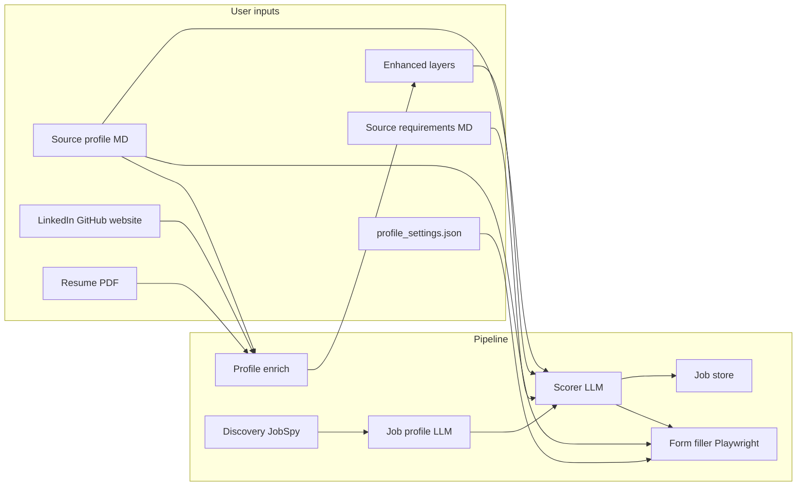

# JobHuntrr — Full System Capability (Program Layout)

**JobHuntrr** is a local, Windows-oriented autonomous job agent for **Rashed Ahmed Alneyadi** (UAE national, quant/investments/AI/space/tech targets). It runs on your machine with **Ollama** (no cloud LLM API required), uses **Playwright** for browsers, and stores jobs in **SQLite** by default (Notion optional).

---

## 1. High-level architecture



**Core loop:** Enrich (optional) → Discover → Score → Log → Apply (optional).

---

## 2. What the program does (capabilities)

### 2.1 Profile & requirements management

| Capability | How |
|------------|-----|
| **Applicant profile** | Markdown: who you are, skills, experience, summaries, positioning |
| **Applicant requirements** | Markdown + YAML frontmatter: score thresholds, geography, target families, skips |
| **Dual-layer profile** | `PROFILE_DUAL_LAYER=1` (default): **source** = your edits; **enhanced** = auto from links/resume; scoring/apply merge both |
| **Custom scoring prompt** | `data/custom_scoring_prompt.md` (ATS mapping, hard rules, positioning) — also editable via Requirements → Scoring prompt tab |
| **Search queries** | `title keywords \| location` per line, or natural-language **custom search prompt** expanded by LLM |
| **Links** | LinkedIn **required**; GitHub, website, extra URLs |
| **Resume parse** | PDF text via `pypdf`; append to enhanced layer or source (legacy mode) |
| **Profile enrich** | Fetches **resume + all links** (LinkedIn session, GitHub API, website, other/extra URLs); Ollama writes structured **Enhanced Profile Layer** (`Verified Experience`, `Technical Evidence`, etc.) to `data/enhanced/` — schema from `jobhuntr_prompt_pack_rashed.md` §2 (read-only) |
| **Safe backups** | `data/profile_backups/` before risky edits |
| **Skill gap prompts** | Compare job description to profile; ask user for missing skills (e.g. Excel) |
| **Application Q&A** | `config/config.py` → `APPLICATION_QA` + email/phone from `profile_settings.json` |

**GUI:** Profile Settings tab (account credentials, links, resume, source + enhanced profile). Requirements tab (source, scoring prompt, search, enhanced).

**Credentials store:** `data/profile_settings.json` only (no `.env`). Legacy `.env` is imported once on first run, then ignored.

**Files:**

| Purpose | Path |
|---------|------|
| Source profile | `data/applicant_profile.md` |
| Source requirements | `data/applicant_requirements.md` |
| Enhanced profile | `data/enhanced/applicant_profile_enhanced.md` |
| Enhanced requirements | `data/enhanced/applicant_requirements_enhanced.md` |
| Scoring / agent rules | `data/custom_scoring_prompt.md` |
| Links / resume path | `data/profile_settings.json`, `data/profile_links.json` |
| Secrets & flags | `data/profile_settings.json` → `"env"` section |
| Template (new setup) | `data/profile_settings.template.json` |

**Where to paste prompts (GUI):**

| Content | GUI location |
|---------|----------------|
| Master “About Me” | Profile Settings → **Source profile** |
| Targets, skips, geography | Requirements → **Source requirements** |
| ATS mapping + scoring rules | Edit `data/custom_scoring_prompt.md` or Requirements → **Scoring prompt** |
| Search lines or NL search | Requirements → **Search** |
| Auto supplements | **Enhanced** tabs (from Enrich; editable) |

---

### 2.2 Job discovery

| Capability | How |
|------------|-----|
| **Search engine** | **JobSpy** (`python-jobspy`) for LinkedIn Jobs plus public indexed hiring signals from `agents/web_signal_discovery.py` |
| **Query list** | Default `SEARCH_QUERIES` in `config/config.py` (quant, PE, AI, space, energy, etc. × UAE locations) **or** overrides from requirements **Search queries** / **Custom search prompt** via `agents/search_planner.py` |
| **Freshness** | `linkedin_hours_fresh` from requirements YAML (default 48h) |
| **Dedup** | `data/seen_urls.json` across runs |
| **Prefilter** | `agents/job_fit.py` — block ADIA/ADIC as **employer**, senior titles, 7+ years, blocked keywords, crowdsourced AI-labeling platforms, etc. |
| **Output** | Normalized job dict: title, company, location, description, URLs, source, `discovered_at` |

**Not implemented:** Automated Google “hidden hiring” crawls; systematic ATS career-portal discovery (only apply-time navigation).

---

### 2.3 Job understanding (job profile)

Before scoring, each job gets a **structured job profile** (`agents/job_profile.py`):

- LLM extracts: role summary, requirements, seniority guess, industry, compensation hints, etc.
- Stored on job as `job_profile` / `job_profile_json`
- Fed into scorer as **STRUCTURED JOB PROFILE** block

This separates **applicant profile** vs **job profile** vs **applicant requirements**.

---

### 2.4 Scoring (0–100) and decisions

| Capability | How |
|------------|-----|
| **Model** | Local **Ollama** (`OLLAMA_MODEL` from `data/profile_settings.json`, default `qwen3:8b`) |
| **Input** | Merged candidate profile + `get_requirements_for_scorer()` + structured job profile + salary snippet |
| **Weights** | compensation_potential **40**, progression_speed **20**, brand_signal **15**, profile_fit **15**, strategic_optionality **10** |
| **Decisions** | `auto_apply` (75–100), `manual_review` (60–74), `skip` (<60), `excluded` (ADIA/ADIC employer rule) |
| **Prefilter** | Runs before LLM — instant score 0 for hard blocks |
| **Salary filter** | `min_salary_aed_monthly` in requirements YAML; `agents/salary_filter.py` parses AED/USD from description; **skip** if parsed pay is below floor; **no skip** if salary not listed |
| **Off-target industry** | Heuristic + LLM flag `outside_target_industry` |
| **Alternate suggestion** | `suggested_alternate`: high score but outside stated targets — still recommend |
| **ATS mapping** | Built-in rules in scorer prompt (Python/backtesting → Partial, math → Yes, etc.) + your custom scoring section |
| **Positioning angle** | `quant`, `investments`, `AI`, `space`, `energy`, `fintech`, `climate`, `strategy`, `cyber` — drives resume pick |

**Rescore:** `rescore_jobs.py` re-runs scorer on jobs already in DB (all / GCC / auto-only filters).

---

### 2.5 Job storage (Notion replacement)

| Mode | How |
|------|-----|
| **Default** | `STORAGE_BACKEND=local` → SQLite `data/jobs.db` (`storage/job_store.py`) |
| **Optional** | `STORAGE_BACKEND=notion` + tokens; `agents/notion_logger.py` + sync |

**Stored fields (local):** company, title, location, score, decision, positioning_angle, source, apply_method, URLs, description, fit/skip reasons, applied flag, notes, outside_target_industry, suggested_alternate, salary fields, job_profile_json, timestamps, etc.

**GUI Jobs tab:** Table + detail pane + edit notes/score/decision + filters (decision, GCC, search text).

**Notion sync (optional):** Pull/push from Profile Settings — local DB remains primary; new columns may not all map to Notion.

---

### 2.6 Application engine

| Capability | How |
|------------|-----|
| **Browser** | Playwright Chromium; persistent LinkedIn session in `data/linkedin_session/` (`setup_linkedin.py`) |
| **Batch** | `apply_jobs_batch()` — shared browser; one context per external job |
| **Dry run default** | Fills forms, screenshots to `logs/`, does **not** submit unless `--live` |
| **Resume upload** | Angle-based PDF paths under `resumes/` or default `Rashed_Alneyadi_Resume.pdf` |
| **Validate fit** | Optional re-check before apply (`agents/job_fit.py`) |
| **Interactive** | `INTERACTIVE_APPLY=1` — GUI/console prompts for unknown fields, signup, CAPTCHA, profile gaps |

**Apply paths:**

1. **LinkedIn job page** — detect Easy Apply vs external; modal wizard fill (`_linkedin_fill_step`)
2. **External ATS** — detect platform from URL/DOM:
   - **Greenhouse, Lever, Ashby, Workable** — dedicated fillers
   - **Workday** — partial wizard support
   - **Unknown** — `_fill_ai_driven` (DOM scan + LLM field mapping)
3. **Vision fallback** — `OLLAMA_VISION_MODEL` (`llava`): screenshot → find buttons / fill fields when DOM fails

**Profile in forms:** Merged profile + `APPLICATION_QA` + Ollama-generated answers for free-text questions.

**Gap handling:** Before apply, `_handle_profile_gaps_before_apply` may prompt for skills not in profile.

---

### 2.7 Orchestration & scheduling

**`orchestrator.py` — `run_pipeline()`:**

0. Optional `maybe_auto_enrich_profile()`
1. Load seen URLs
2. `discover_jobs()`
3. `score_jobs_batch()`
4. If `apply_enabled`: `apply_jobs_batch()` on `auto_apply` only
5. `log_jobs_batch()`
6. Print daily summary (counts, top 5 jobs)

**CLI flags:**

```text
python orchestrator.py --run-once [--apply] [--live] [--headless] [--limit N]
                       [--no-auto-enrich] [--no-validate-fit]
python orchestrator.py --schedule   # APScheduler every RUN_EVERY_HOURS (default 4)
```

**Launchers:** `START_JOBHUNTER.bat`, `START_GUI.bat`, `LAUNCH_JOBHUNTRR.bat`

---

## 3. CLI & GUI command map

### PowerShell / CLI

| Command | Purpose |
|---------|---------|
| `python gui/jobhunter_gui.py` | Main GUI |
| `python orchestrator.py --run-once` | Discover + score only |
| `python orchestrator.py --run-once --apply` | + dry-run apply |
| `python orchestrator.py --run-once --apply --live` | + real submit |
| `python apply_jobs.py [--gcc-only] [--live] [--limit N]` | Apply pending `auto_apply` from DB |
| `python rescore_jobs.py [--gcc-only] [--auto-only]` | Re-score stored jobs |
| `python check_gcc_queue.py` | Inspect GCC pending queue |
| `python setup_linkedin.py` | Save LinkedIn login session |
| `python setup_notion.py` | Create Notion DB (optional) |
| `python test_job_fit.py` | Test fit prefilter |
| `python kill_browsers.py` | Kill stuck Playwright browsers |
| `apply_from_notion.py` / `rescore_notion.py` | Notion-backend variants |

### GUI actions (Jobs tab)

| Action | Effect |
|--------|--------|
| Search + score only | Full discovery and scoring pipeline |
| Search + apply now (LIVE) | Discover, score, and submit eligible jobs once |
| Start repeating search + apply (LIVE) | Run scheduled autonomous live cycles |
| Test ... (NO SUBMIT) | Fill forms for diagnostics without submitting |
| Re-score ... | Re-run scorer on stored jobs |
| Apply queued jobs now (LIVE) | Submit queued auto-apply jobs |
| Refresh jobs / Open selected job / Close browser windows | Table refresh and browser utilities |
| Mark applied, Edit score/fit, Set decision | Manual job overrides |
| Check profile gaps | Compare selected job to profile skills |

---

## 4. Configuration map

| What | Where |
|------|--------|
| Score thresholds, salary min, freshness | YAML top of `data/applicant_requirements.md` |
| Blocklists, tier-1 companies, role families | `config/config.py`, `config/applicant_requirements.py` |
| Default search queries | `config/config.py` → `SEARCH_QUERIES` |
| Ollama URL/models | `config/config.py` |
| Storage backend | Profile Settings → `STORAGE_BACKEND` |
| Dual layer, auto enrich, interactive apply | Profile Settings (`PROFILE_DUAL_LAYER`, `AUTO_ENRICH_PROFILE`, `INTERACTIVE_APPLY`) |
| Secrets | `data/profile_settings.json` — never commit (see `.gitignore`) |

**Example requirements YAML:**

```yaml
---
auto_apply: 75
manual_review: 60
max_years_hard_skip: 7
min_requirements_match_pct: 50
linkedin_hours_fresh: 48
ats_days_fresh: 7
min_salary_aed_monthly: 12000
---
```

---

## 5. Data flow: three-way matching

1. **Applicant profile** (source + enhanced) — what you offer
2. **Applicant requirements** (source + enhanced + custom scoring) — what you want; hard rules
3. **Job profile** (from posting) — what the role demands

**Scorer** compares (2) and (3) against (1), outputs score, decision, fit/skip text, angle, flags.

**Example intent:** Stated target = quant; posting = strong data engineer at G42 → may score high with `suggested_alternate=true` even if `outside_target_industry=true`.

**Dual-layer merge (scoring/apply):**

```
## Source profile (your content — authoritative)
…applicant_profile.md…

## Enhanced profile (auto-generated — supplemental only)
…applicant_profile_enhanced.md…
```

Same pattern for requirements via `config/md_loader.py` → `get_candidate_profile_for_prompt()` and `get_requirements_for_scorer()`.

---

## 6. Hard rules (built-in)

| Rule | Behavior |
|------|----------|
| ADIA / ADIC as **employer** | `excluded` — never apply (past internships OK in profile text) |
| 7+ years hard requirement | Prefilter skip |
| Senior / VP / Director titles | Prefilter skip |
| AI-agent-only / crowdsourced labeling jobs | Skip |
| Commission-only, unpaid intern, talent pools | Skip |
| Salary below `min_salary_aed_monthly` | Auto-**skip** when pay is parsed from listing and below floor |

---

## 6b. Salary filtering (when listed)

1. Set floor in YAML at top of `data/applicant_requirements.md`:
   ```yaml
   min_salary_aed_monthly: 12000   # e.g. 25000 or 35000 for stricter hard skip
   ```
2. During scoring, `parse_salary_from_text()` reads the job description for AED/USD ranges, `k` notation, monthly/yearly (converted to AED/month).
3. If parsed max pay is below floor → `decision: skip`, `salary_below_minimum: true`, `skip_reason` explains gap.
4. If **no salary in text** → job is still scored (LLM may judge compensation in score breakdown).
5. GUI: **Salary** column, job detail shows snippet; filter **Low salary** for below-floor jobs.
6. Re-score after changing floor: `python rescore_jobs.py --gcc-only`

Note: Many LinkedIn posts omit salary in the scraped description — hard filter only applies when pay appears in text.

---

## 7. Limitations (honest)

| Area | Status |
|------|--------|
| Full verbatim master prompt | Condensed in `applicant_profile.md` + `custom_scoring_prompt.md`; extend files if you want every paragraph |
| Discovery scope | LinkedIn via JobSpy only (not full agent spec’s Google/ATS crawl) |
| Daily summary | Partial vs 8-section template (counts + top 5) |
| README | Some outdated lines (Indeed, Notion-first) |
| Workday / complex ATS | Best-effort; may need manual review |
| Degree wording | System uses **NYU New York** for BA; NYUAD = research only |
| Live apply risk | Always dry-run and review `logs/*.png` before `--live` |

---

## 8. Repository layout

```
jobhuntrr/
├── program_layout.md          # This file
├── orchestrator.py            # Main pipeline + scheduler
├── apply_jobs.py              # Apply from local DB
├── rescore_jobs.py
├── gui/jobhunter_gui.py       # Full UI
├── config/
│   ├── config.py              # Blocklists, SEARCH_QUERIES, APPLICATION_QA
│   ├── md_loader.py           # Profile/requirements load, dual-layer merge
│   ├── applicant_requirements.py
│   └── env_settings.py        # GUI ↔ profile_settings.json
├── agents/
│   ├── discovery.py           # JobSpy
│   ├── search_planner.py      # NL → query list
│   ├── job_profile.py         # Structured job extraction
│   ├── scorer.py              # 0–100 LLM scoring
│   ├── job_fit.py             # Prefilter + validate fit
│   ├── target_industry.py     # Off-target heuristics
│   ├── salary_filter.py
│   ├── profile_manager.py     # Enrich, links, resume, gaps
│   ├── form_filler.py         # Playwright + vision apply
│   ├── apply_prompts.py       # Interactive Q&A
│   ├── job_logger.py          # Log to SQLite/Notion
│   └── notion_sync.py
├── storage/job_store.py       # SQLite CRUD
└── data/
    ├── applicant_profile.md
    ├── applicant_requirements.md
    ├── custom_scoring_prompt.md
    ├── profile_settings.json      # credentials (gitignored)
    ├── profile_settings.template.json
    ├── enhanced/
    ├── jobs.db
    ├── seen_urls.json
    ├── profile_backups/
    └── linkedin_session/
```

---

## 9. Typical operator workflow

1. Fill **Source profile** + **Scoring prompt** + **Search** in GUI; Save.
2. Fill **Profile Settings → Account & credentials**; Save (writes `data/profile_settings.json`).
3. `python setup_linkedin.py` once.
4. **Enrich from links + resume** (Profile Settings).
5. **Search + score only** (GUI or `python orchestrator.py --run-once`).
6. Review jobs in GUI; adjust decisions/notes.
7. **Test queued form fill (NO SUBMIT)** -> check `logs/`.
8. **Apply queued jobs now (LIVE)** only when satisfied.

---

## 10. External dependencies

- **Python 3.11+**, `requirements.txt`
- **Ollama** running: `qwen3:8b` or model in `profile_settings.json` (scoring/text); `llava` optional (vision fallback, 16 GB+ recommended)
- **Playwright Chromium** (`playwright install chromium`)
- **Windows** (primary; PowerShell-friendly)
- Optional: **Notion API** if `STORAGE_BACKEND=notion`

---

## 11. Portal support (apply)

| ATS / channel | Support |
|---------------|---------|
| LinkedIn Easy Apply | Yes (Playwright + session) |
| Greenhouse | Yes |
| Lever | Yes |
| Ashby | Yes |
| Workable | Yes |
| Workday | Partial |
| Generic / unknown | AI-driven DOM + vision fallback |
| iCIMS / Taleo | Best-effort via generic filler |

---

*Document version: aligned with JobHuntrr codebase — dual-layer profile, `profile_settings.json` (no `.env`), `custom_scoring_prompt.md`, salary floor, local SQLite default, LinkedIn Jobs plus indexed hiring-signal discovery.*
